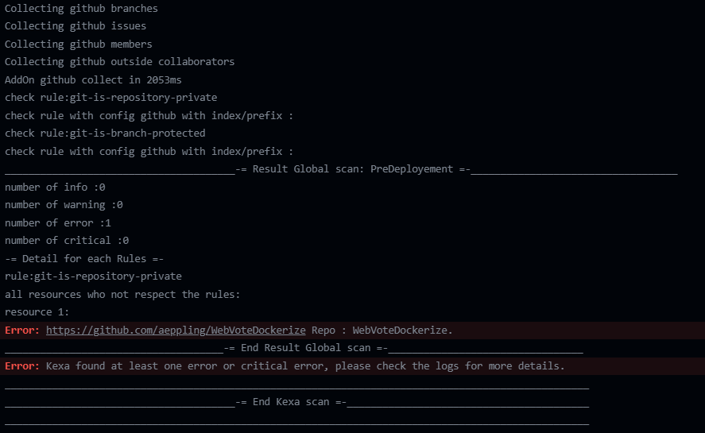

<div id="top"></div>
<!--
*** Thanks for checking out the Best-README-Template. If you have a suggestion
*** that would make this better, please fork the repo and create a pull request
*** or simply open an issue with the tag "enhancement".
*** Don't forget to give the project a star!
*** Thanks again! Now go create something AMAZING! :D
-->


<!-- PROJECT SHIELDS -->
<!--
*** I'm using markdown "reference style" links for readability.
*** Reference links are enclosed in brackets [ ] instead of parentheses ( ).
*** See the bottom of this document for the declaration of the reference variables
*** for contributors-url, forks-url, etc. This is an optional, concise syntax you may use.
*** https://www.markdownguide.org/basic-syntax/#reference-style-links
-->
[![Contributors][contributors-shield]][contributors-url]
[![Forks][forks-shield]][forks-url]
[![Stargazers][stars-shield]][stars-url]
[![Issues][issues-shield]][issues-url]
[![MIT License][license-shield]][license-url]


<!-- PROJECT LOGO -->
<br />
<div align="center">
  <a href="https://github.com/4urcloud/Kexa_githubAction">
    
  </a>

  <h3 align="center">Kexa Github Action</h3>

  <p align="center">
    Optimize your infrastructure with the GitHub Actions version of Kexa's generic alerting tools. Avoid wasting money on unnecessary infrastructure, avoidable security breaches and service failures.
    <br />
    <a href="https://github.com/4urcloud/Kexa_githubAction"><strong>Explore the docs »</strong></a>
    <br />
    <br />
    <a href="https://github.com/4urcloud/Kexa_githubAction/issues">Report Bug</a>
    ·
    <a href="https://github.com/4urcloud/Kexa_githubAction/issues">Request Feature</a>
  </p>
</div>


<!-- TABLE OF CONTENTS -->
<details>
  <summary>Table of Contents</summary>
  <ol>
    <li>
      <a href="#about-the-project">About The Project</a>
    </li>
    <li>
      <a href="#getting-started">Getting Started</a>
      <ul>
        <li><a href="#prerequisites">Prerequisites</a></li>
        <li><a href="#installation">Installation</a></li>
      </ul>
    </li>
    <li><a href="#usage">Usage</a></li>
    <li><a href="#roadmap">Roadmap</a></li>
    <li><a href="#contributing">Contributing</a></li>
    <li><a href="#license">License</a></li>
    <li><a href="#contact">Contact</a></li>
    <li><a href="#acknowledgments">Acknowledgments</a></li>
  </ol>
</details>


<!-- ABOUT THE PROJECT -->
## About The Project

We have built Kexa to automatize verifications across your working environments (cloud, workspace, APIs endpoints), with a easy-to-deploy script that will allow you to optimize your costs, conformity and security.

To ensure your workflows integrity on a hight frequency check, we have built the github action of Kexa. The "action" version of kexa provides the same functionality as its classic counterparts, with the exception of being able to perform "pre-production" checks before any merge.

Run it and get all the available optimizations with the different notification tools (logs, mail, sms, webhook, Teams, and more incoming with generics tools).

Macro-scale operation is extremely similar to Kexa. That's why, in this documentation, we'll only deal with the technical differences between Kexa and Macro-scale operation.
For more information on macro-scale operation, see [here](https://github.com/4urcloud/Kexa/blob/main/documentation/Documentation-Kexa.md)

<p align="right">(<a href="#top">back to top</a>)</p>


<!-- GETTING STARTED -->
## Getting Started

### Prerequisites

#### Knowledge

Before attempting to implement Kexa CI/CD, we advise you to have a global knowledge base on [Kexa](https://github.com/4urcloud/Kexa/blob/main/documentation/Documentation-Kexa.md).

#### Technical

Only the credentials to access your various addons need to be retrieved upstream.
Depending on the addons you wish to use, please refer to their documentation:

- [AWS](./documentation/AWS.md)
- [Azure](./documentation/Azure.md)
- [GCP](./documentation/GCP.md)
- [Github](./documentation/Github.md)
- [Google Drive](./documentation/GoogleDrive.md)
- [Google Workspace](./documentation/GoogleWorkspace.md)
- [HTTP/HTTPS](./documentation/HTTP.md)
- [Kubernetes](./documentation/Kubernetes.md)
- [O365](./documentation/O365.md)

### Installation

If not exist, add to your repository the "config" folder in which you will put your [kexa configuration](https://github.com/4urcloud/Kexa/blob/main/documentation/Documentation-Kexa.md#global-configuration)
If not exist, add a dedicate folder for your [rules](https://github.com/4urcloud/Kexa/blob/main/documentation/Documentation-Kexa.md#rules-editing) for example ("./rules").
You can use our rules at [here](https://github.com/4urcloud/Kexa/tree/main/Kexa/rules).

<br/>

The configuration file will be used to set up your projects, that will regroup by provider/service name the rules you want to apply in your scan.
Those rules will be defined in YAML files located in the /rules folder.

<br/>

To use the [github action](https://docs.github.com/fr/actions/learn-github-actions/understanding-github-actions) you can use such as:

```yaml
    steps:
      -   name: Kexa Git action
          uses: 4urcloud/Kexa_githubAction@1.1.2 #to see all version available : https://github.com/4urcloud/Kexa_githubAction/releases
          with:
              MYOWNRULES: "./rules" #Path conform to our example
              #add here all your "environment variable" here
```

<br/>

Here is a full example of a github workflow with Kexa action :
```yaml
name: KexaTestWorkflow

on:
  push:
    branches:
      - main

jobs:
  kexa-action:
    runs-on: ubuntu-latest

    steps:
      - name: Checkout Code
        uses: actions/checkout@v2

      - name: Kexa Git action
        uses: 4urcloud/Kexa_githubAction@1.0.16
        with:
          MYOWNRULES: "./rules"
          ENVVAR1: ""
          ENVVAR2: ""
```

You can also use key manager. The principle of use is the same as for [Kexa](https://github.com/4urcloud/Kexa/blob/main/documentation/Documentation-Kexa.md#password-manager). Here are some examples of use with and without key manager : [Here](./documentation/github/)

</br>

With this workflow, Kexa will be triggered at each push on the main branch of this repository.

<br/>

If Kexa find a issue that rise an alert with a level superior than warning (error or fatal), the workflow will be canceled.

<br/>

Here is a sample of a Kexa scan in github action that rise an error :

<div align="center">
	


</div>

<p align="right">(<a href="#top">back to top</a>)</p>

<br/>

<!-- USAGE EXAMPLES -->
## Usage

Kexa offers [many advantages](./documentation/Documentation-Kexa.md#utility-examples). Unlike its counterpart, the Kexa_githubAction has the advantage of being able to stop github actions and thus cancel the pull request. This advantage makes it possible to perform "pre-production" checks to ensure that the deployment environment complies with the required standards. What's more, with the scheduling option in github action you can run regular tests every 5min or more to check the health of your web applications (addOn HTTP) or pods in kubernetes (addOn Kubernetes) at low cost.

En the end, the reading grid for github Action and classic Kexa is the same : see [here](https://github.com/4urcloud/Kexa#results-explanation)

<p align="right">(<a href="#top">back to top</a>)</p>

## <div align="center" id="roadmap">**Roadmap**</div>
<br/>

<details>
<summary>All Achievements</summary>

- ✅ Setting notification levels

<div class='spliter_code'></div>

- ✅ Aws check in:
    - ✅ ec2Instance
    - ✅ ec2SG
    - ✅ ec2Volume
    - ✅ rds
    - ✅ resourceGroup
    - ✅ tagsValue
    - ✅ ecsCluster
    - ✅ ecrRepository
- ✅ Azure check in:
    - ✅ vm
    - ✅ rg
    - ✅ disk
    - ✅ nsg
    - ✅ virtualNetwork
    - ✅ networkInterfaces
    - ✅ aks
    - ✅ mlWorkspace
    - ✅ mlJobs
    - ✅ mlComputes
    - ✅ mlSchedule
- ✅ Gcp check in:
    - ✅ tasks_queue
    - ✅ compute
    - ✅ storage
    - ✅ project
    - ✅ billingAccount
    - ✅ cluster
    - ✅ workflows
    - ✅ websecurity
    - ✅ connector
    - ✅ vmware
    - ✅ namespace
    - ✅ certificate
    - ✅ secret
    - ✅ connectivity_test
    - ✅ resource_settings
    - ✅ redis_instance
    - ✅ os_config
    - ✅ org_policy_constraint
    - ✅ airflow_image_version
    - ✅ disk
    - ✅ compute_item
- ✅ Github check in:
    - ✅ repositories
    - ✅ branches
    - ✅ issues
    - ✅ organizations
    - ✅ members
    - ✅ teams
    - ✅ teamProjects
    - ✅ teamMembers
    - ✅ teamRepositories
    - ✅ outsideCollaborators
- ✅ GoogleDrive check in:
    - ✅ files
- ✅ GoogleWorkspace check in:
    - ✅ user
    - ✅ domain
    - ✅ group
    - ✅ role
    - ✅ orgaunit
    - ✅ calendar
    - ✅ file
    - ✅ drive
- ✅ Http check in:
    - ✅ request
- ✅ Kubernetes check in:
    - ✅ namespaces
    - ✅ pods
    - ✅ services
    - ✅ helm
    - ✅ configmap
    - ✅ deployment
    - ✅ replicaset
    - ✅ statefulset
    - ✅ daemonset
    - ✅ ingress
    - ✅ persistentvolume
    - ✅ persistentvolumeclaim
    - ✅ secret
    - ✅ serviceaccount
    - ✅ storageclass
    - ✅ networkpolicy
    - ✅ event
    - ✅ node
    - ✅ apiservice
    - ✅ lease
    - ✅ componentstatus
    - ✅ limitrange
    - ✅ resourcequota
    - ✅ podtemplate
- ✅ O365 check in:
    - ✅ sku
    - ✅ user
    - ✅ domain
    - ✅ secure_score
    - ✅ auth_methods
    - ✅ organization
    - ✅ directory_role
    - ✅ sp
    - ✅ alert
    - ✅ incident
    - ✅ app_access_policy
    - ✅ group
    - ✅ policy
    - ✅ conditional_access
    - ✅ sharepoint_settings

<div class='spliter_code'></div>

</details>

Next step:

- [ ] Kexa SaaS
- [ ] VM Ware
- [ ] OVH
- [ ] Database
	- [ ] Postgres
	- [ ] SQL
	- [ ] Mysql/MariaDB
	- [ ] Oracle

If you would like additional functionality, please send us your request. : <a href="https://github.com/4urcloud/Kexa/issues">Request Feature</a>
<p align="right">(<a href="#top">back to top</a>)</p>

## <div align="center" id="license">**License**</div>
<br/>

Distributed under the MIT License. See [`LICENSE`](https://github.com/4urcloud/Kexa_githubAction/blob/main/LICENCE) for more information just [here](https://github.com/4urcloud/Kexa_githubAction/blob/main/LICENCE).


## <div align="center" id="contact">**Contact**</div>
<br/>

[contact@4urcloud.com](mailto:contact@4urcloud.com)
[![LinkedIn][linkedin-shield]][linkedin-url]

<p align="right">(<a href="#top">back to top</a>)</p>

<!-- ACKNOWLEDGMENTS -->
## Acknowledgments

If you'd like to find out more about Kexa:

* [Github Kexa](https://github.com/4urcloud/Kexa)
* [Website Kexa](https://www.kexa.io/)

[linkedin-shield]: https://img.shields.io/badge/-LinkedIn-black.svg?style=for-the-badge&logo=linkedin&colorB=555
[linkedin-url]: https://www.linkedin.com/company/4urcloud/
[contributors-shield]: https://img.shields.io/github/contributors/4urcloud/Kexa_githubAction.svg?style=for-the-badge
[contributors-url]: https://github.com/4urcloud/Kexa_githubAction/graphs/contributors
[forks-shield]: https://img.shields.io/github/forks/4urcloud/Kexa_githubAction.svg?style=for-the-badge
[forks-url]: https://github.com/4urcloud/Kexa_githubAction/network/members
[stars-shield]: https://img.shields.io/github/stars/4urcloud/Kexa_githubAction.svg?style=for-the-badge
[stars-url]: https://github.com/4urcloud/Kexa_githubAction/stargazers
[issues-shield]: https://img.shields.io/github/issues/4urcloud/Kexa_githubAction.svg?style=for-the-badge
[issues-url]: https://github.com/4urcloud/Kexa_githubAction/issues
[license-shield]: https://img.shields.io/github/license/4urcloud/Kexa_githubAction.svg?style=for-the-badge
[license-url]: https://github.com/4urcloud/Kexa_githubAction/blob/master/LICENSE.txt
